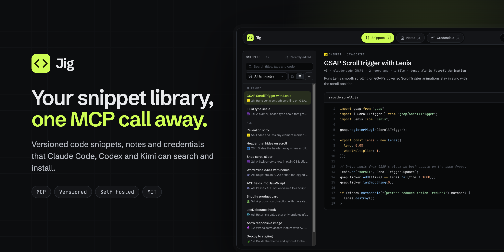
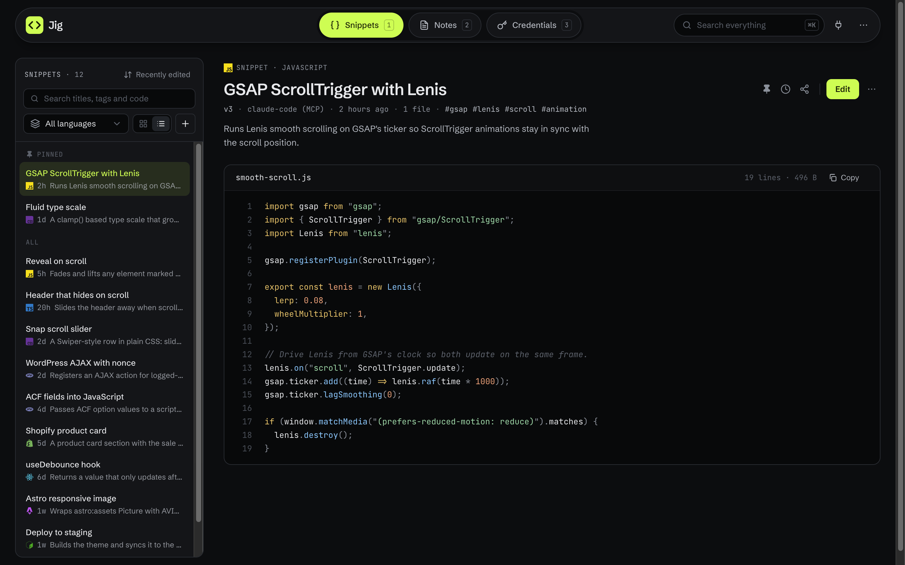
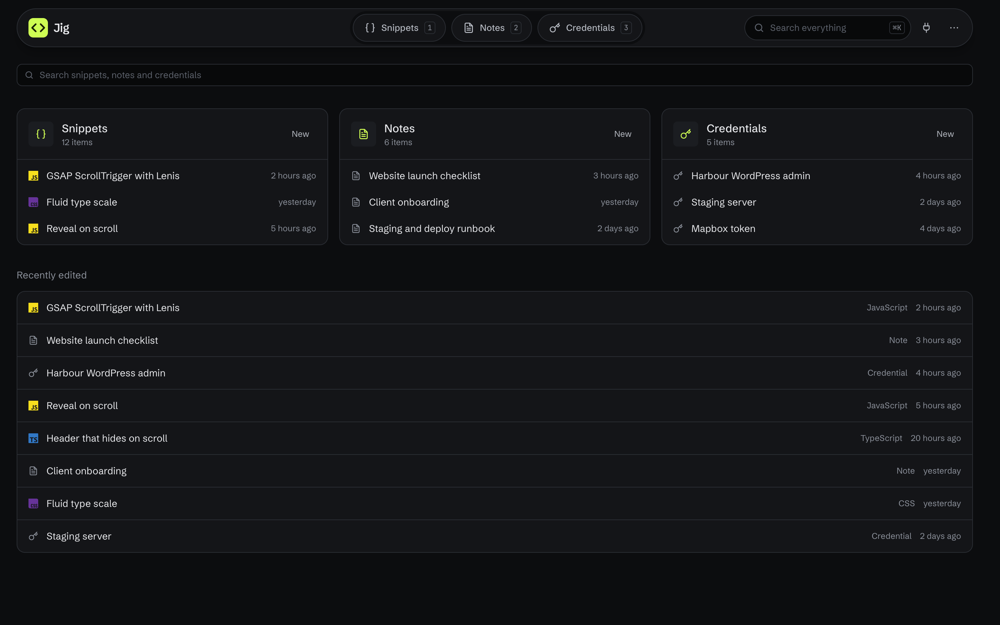
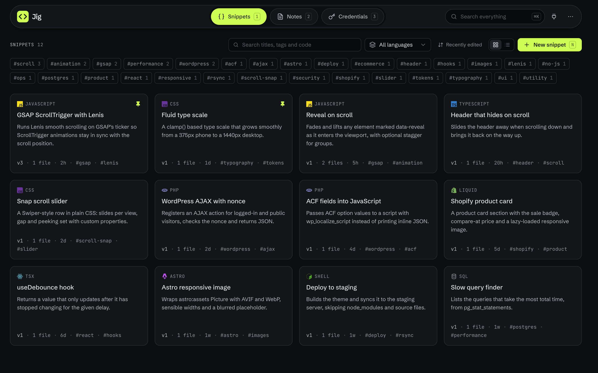
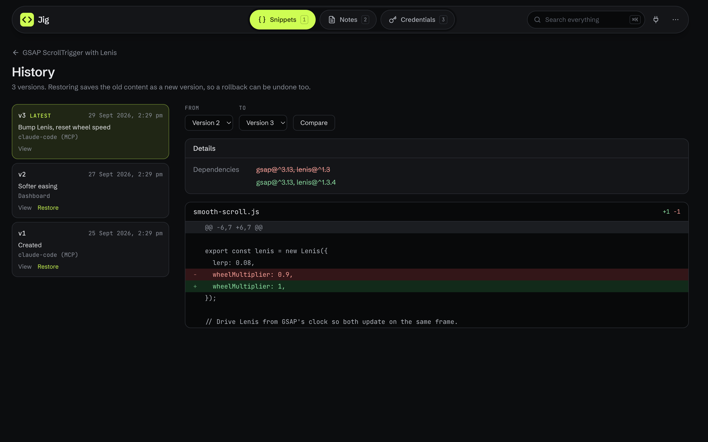
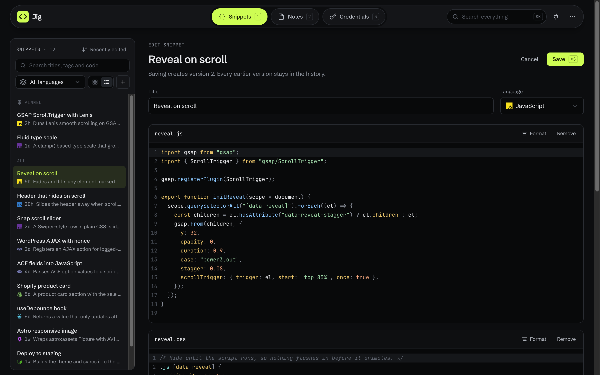
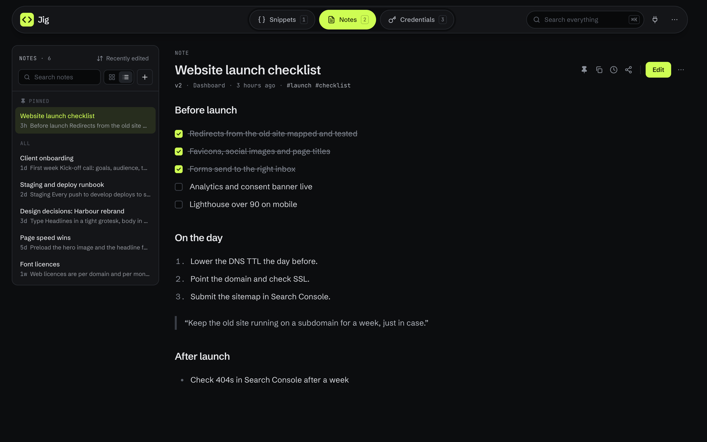
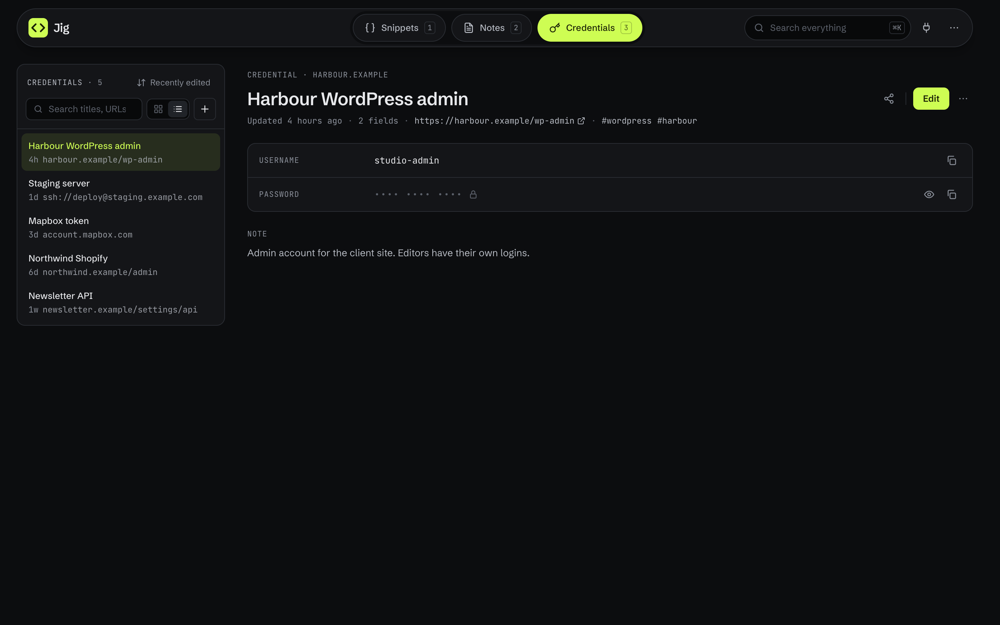

<p align="center">
  
</p>

<p align="center">
  <a href="#quickstart"><strong>Quickstart</strong></a> &middot;
  <a href="#screenshots"><strong>Screenshots</strong></a> &middot;
  <a href="#connect-an-agent"><strong>Connect an agent</strong></a> &middot;
  <a href="#mcp-tools"><strong>MCP tools</strong></a> &middot;
  <a href="#run-locally"><strong>Run locally</strong></a>
</p>

<p align="center">
  <a href="LICENSE"></a>
  
  
  
</p>

<br/>

# Your snippet library, one MCP call away.

**Jig is a private, self-hosted library of code snippets, notes and credentials that your AI coding agents can reach over MCP.**

Ask Claude Code, Codex or Kimi to *"add the GSAP snippet from Jig"* and they search your library, fetch the files, install the dependencies and wire it into the project, following the instructions you saved with it. Every edit is a new version, so when a snippet stops working you can see exactly what changed and roll it back, from the dashboard or from an agent.

Each person runs their own copy, with their own database. Nothing is shared with anyone else.

|        | Step | Example |
| ------ | ---- | ------- |
| **01** | Deploy your copy | One click on Vercel, with a free Neon database created for you. |
| **02** | Connect your agents | Create a token on the **Connect** page and paste the command it shows. |
| **03** | Ask for a snippet | *"Add my Lenis setup from Jig"*: the agent finds it, installs it and adapts it. |

<br/>

<div align="center">
<table>
  <tr>
    <td align="center"><strong>Works<br/>with</strong></td>
    <td align="center"><strong>Claude Code</strong><br/><sub>CLI, bearer token</sub></td>
    <td align="center"><strong>Codex</strong><br/><sub>config.toml</sub></td>
    <td align="center"><strong>Kimi Code</strong><br/><sub>CLI, bearer token</sub></td>
    <td align="center"><strong>Cursor</strong><br/><sub>MCP over HTTP</sub></td>
    <td align="center"><strong>Any MCP client</strong><br/><sub>Streamable HTTP</sub></td>
  </tr>
</table>

<em>If it speaks MCP over HTTP, it can use your library.</em>

</div>

<br/>

## Jig is right for you if

- ✅ You copy the **same setup code between projects**: Lenis, GSAP, a WordPress AJAX handler, a Shopify section
- ✅ You want your **AI agents to use your code**, not whatever they guess
- ✅ You want **every change versioned**, with a diff and a one-click rollback
- ✅ You keep **runbooks, checklists and client notes** next to the code
- ✅ You need somewhere safe for **logins and API keys** that agents can never read, and **notes you can lock** behind Touch ID
- ✅ You'd rather **own your data**: your server, your database, MIT licensed

<br/>

## Features

<table>
<tr>
<td align="center" width="33%">
<h3>🧩 Snippets</h3>
One or more files, a language, dependencies to install and instructions for agents. A code editor with syntax colours and a <strong>Format</strong> button.
</td>
<td align="center" width="33%">
<h3>🔌 MCP endpoint</h3>
Agents search, fetch, create, update, diff and restore over Streamable HTTP. Each token is named, so every version records which agent saved it.
</td>
<td align="center" width="33%">
<h3>🕘 Version history</h3>
Every save is a full snapshot. Compare any two versions and restore one as a new version, so even a rollback can be undone.
</td>
</tr>
<tr>
<td align="center">
<h3>📝 Notes</h3>
A rich editor with headings, lists, checklists, quotes and code that saves plain markdown. Versioned and searchable by agents, or <strong>locked</strong>: encrypted, hidden from agents, opened with Touch ID.
</td>
<td align="center">
<h3>🔐 Credentials</h3>
Logins and API keys with secret fields encrypted (AES-256-GCM). Shown only when you click Reveal. Never exposed over MCP.
</td>
<td align="center">
<h3>🔗 Share links</h3>
Send anything to someone without an account through a read-only link that can expire, stop after a number of views, and need a passcode.
</td>
</tr>
<tr>
<td align="center">
<h3>🗂️ Organise</h3>
A split view or a grid, sorting, pinning, instant search (code included), language and tag filters, and a right-click menu on every item.
</td>
<td align="center">
<h3>⌨️ Keyboard first</h3>
<code>1</code> <code>2</code> <code>3</code> to switch sections, <code>N</code> for new, <code>G</code>/<code>L</code> for the layout, arrows for the list and <code>⌘S</code> to save.
</td>
<td align="center">
<h3>📱 Installable</h3>
Install it from Chrome or Edge for its own window and Dock icon. Works on your phone too, with a tab bar in thumb reach. Sign in with a passkey (Touch ID, Face ID) instead of your password.
</td>
</tr>
</table>

<br/>

## Screenshots

<p align="center">
  
</p>

<table>
  <tr>
    <td width="50%"><p align="center"><sub>Every section at a glance</sub></p></td>
    <td width="50%"><p align="center"><sub>Browse by language and tag</sub></p></td>
  </tr>
  <tr>
    <td><p align="center"><sub>Every save is a version, with a diff</sub></p></td>
    <td><p align="center"><sub>A real code editor, with Format</sub></p></td>
  </tr>
  <tr>
    <td><p align="center"><sub>Notes for runbooks and checklists</sub></p></td>
    <td><p align="center"><sub>Credentials, encrypted and agent-proof</sub></p></td>
  </tr>
</table>

<br/>

## Problems Jig solves

| Without Jig | With Jig |
| --- | --- |
| ❌ The good version of that script lives in a project from two years ago, and you can't remember which one. | ✅ Search your library by name, tag, language or the code itself. |
| ❌ Your agent writes its own smooth-scroll setup from scratch, differently every time. | ✅ It fetches **your** setup, installs the dependencies and follows your notes. |
| ❌ Someone "improved" a snippet and now it breaks on Safari. | ✅ Diff any two versions and roll back in one click, from the dashboard or an agent. |
| ❌ API keys sit in a notes app, one paste away from an agent's context. | ✅ Secrets are encrypted in Credentials, which agents can't read at all. |
| ❌ Sending a client their login means a password in an email. | ✅ A share link that needs a passcode, expires and locks after 5 wrong tries. |

<br/>

## Quickstart

[](https://vercel.com/new/clone?repository-url=https%3A%2F%2Fgithub.com%2Fnboada%2Fjig&project-name=jig&repository-name=jig&env=ADMIN_PASSWORD%2CJIG_TIMEZONE&envDefaults=%7B%22JIG_TIMEZONE%22%3A%22UTC%22%7D&envDescription=ADMIN_PASSWORD+is+the+password+for+your+dashboard%3B+use+a+long+one.+JIG_TIMEZONE+is+an+IANA+time+zone+for+dates%2C+e.g.+Europe%2FLondon.&envLink=https%3A%2F%2Fgithub.com%2Fnboada%2Fjig%23environment-variables&stores=%5B%7B%22type%22%3A%22integration%22%2C%22integrationSlug%22%3A%22neon%22%2C%22productSlug%22%3A%22neon%22%2C%22protocol%22%3A%22storage%22%7D%5D)

1. **Click Deploy with Vercel.** Vercel copies this repository into your GitHub account and creates a free [Neon](https://neon.tech) Postgres database for it. The tables are created the first time the app runs.
2. **Choose a password** when Vercel asks for `ADMIN_PASSWORD`. Use a long one, since it protects everything in your library. Set `JIG_TIMEZONE` to your time zone, such as `Europe/London`.
3. **Open your new site and log in.**
4. **Connect your agents.** Open **Connect**, create a token for each agent and run the setup command it shows.
5. **Optional: turn on credentials.** The first time you open **Credentials**, click **Generate a key**, add it to Vercel as `JIG_ENCRYPTION_KEY` and redeploy. Keep a copy in your password manager.
6. **Recommended: run it next to your database.** In Vercel, open **Settings → Functions → Function Region** and pick your Neon database's region (shown under **Storage**), then redeploy. Every page makes a few queries, and in the same region each one takes milliseconds.

<br/>

## Connect an agent

The Connect page shows these commands with your URL and token filled in.

```bash
# Claude Code (available in every project)
claude mcp add --transport http --scope user jig https://YOUR_DOMAIN/api/mcp \
  --header "Authorization: Bearer jig_..."

# Kimi Code CLI
kimi mcp add --transport http jig https://YOUR_DOMAIN/api/mcp \
  --header "Authorization: Bearer jig_..."
```

```toml
# Codex: ~/.codex/config.toml, plus export JIG_TOKEN=jig_... in your shell profile
[mcp_servers.jig]
url = "https://YOUR_DOMAIN/api/mcp"
bearer_token_env_var = "JIG_TOKEN"
```

Tokens are stored as SHA-256 hashes, shown once, and can be revoked on the Connect page. Each version records which token saved it.

<br/>

## MCP tools

Tool output is formatted markdown, ready for an agent to read.

| Tool | What it does |
| --- | --- |
| `search_snippets` | Find by keyword, language or tag. Also searches file contents. |
| `get_snippet` | Files, dependencies and integration instructions, latest or any version. Suggests matches for a wrong slug. |
| `create_snippet` | Save a new snippet (one or more files). |
| `update_snippet` | Save a new version. Only changed fields are needed. `baseVersion` stops an agent from overwriting a newer edit. |
| `list_snippet_versions` | History with change notes and who made each change. |
| `diff_snippet_versions` | Unified diff between two versions. |
| `restore_snippet_version` | Roll back by saving an old version as the newest one. Nothing is ever deleted from history. |
| `search_notes` | Find notes by keyword or tag, including the note text. |
| `get_note` | A note's text, latest or any version. |
| `create_note` / `update_note` | Save a note or a new version of one. `baseVersion` works as for snippets. |
| `list_note_versions` / `restore_note_version` | Note history and rollback. |

Snippets and notes can only be deleted from the dashboard, never by an agent. Credentials are never available over MCP. When filtering by language, `javascript` also finds TypeScript, JSX and TSX, and `css` also finds SCSS.

<br/>

## Keyboard shortcuts

| Key | What it does |
| --- | --- |
| `1` `2` `3` | The sections, in the header's order (drag the tabs to reorder) |
| `N` | New item in the current section |
| `E` | Edit the snippet, note or credential that's open |
| `G` / `L` | Grid or list layout |
| `↑` `↓` | Move through the list |
| `⌘S` | Save, on new and edit pages |
| `Esc` | Cancel, on new and edit pages (twice if you changed something) |

The others are ignored while you type, and on new and edit pages, so they can't throw away unsaved work.

<br/>

## Environment variables

| Variable | Required | What it does |
| --- | --- | --- |
| `ADMIN_PASSWORD` | Yes | The password for your dashboard, at least 12 characters. After 10 wrong attempts from one address, logins from it are paused for 15 minutes, and after 100 from anywhere, password logins pause for everyone (a passkey still works). |
| `DATABASE_URL` | Set for you | Postgres connection string. The Deploy button's Neon database sets it. Leave it empty locally to use a built-in database stored in `.data/`. |
| `JIG_ENCRYPTION_KEY` | For credentials | Encrypts saved secrets: 32 random bytes in base64. The Credentials page generates one for you. If it is lost, saved secrets cannot be recovered. |
| `SESSION_SECRET` | No | Mixed into the key that signs the login cookie, together with a random secret Jig makes for itself in the database. Defaults to `ADMIN_PASSWORD`. Set a random value (`openssl rand -hex 32`) if you want changing the password to be independent of sessions. |
| `JIG_ORIGIN` | No | The site's address, e.g. `https://snippets.example.com`, if passkeys should always belong to it rather than to whichever address the page was opened at. |
| `JIG_TIMEZONE` | No | Time zone for dates in the dashboard, e.g. `Europe/London`. Defaults to `Australia/Sydney`. |

Changing a variable in Vercel only takes effect after a redeploy.

<details>
<summary><strong>Forgot your password?</strong></summary>


Your password is the `ADMIN_PASSWORD` environment variable, so anyone who can sign in to your Vercel account can recover it:

1. Open your project on [vercel.com](https://vercel.com/dashboard) and go to **Settings → Environment Variables**.
2. Find `ADMIN_PASSWORD`. Reveal it to see it, or edit it to set a new one.
3. If you changed it, redeploy (**Deployments → ⋯ → Redeploy**). New values only apply to new deployments.

Changing it signs out every open session, unless you set `SESSION_SECRET`. To sign out every browser without changing it, use **⋯ → Sign out everywhere**. Your snippets, notes and credentials are not affected; credentials are encrypted with `JIG_ENCRYPTION_KEY`, not the password.

</details>

<br/>

## Updating your copy

The Deploy button makes an independent copy, not a fork, so it doesn't update itself. To pull in new versions:

```bash
git remote add upstream https://github.com/nboada/jig.git   # once
git pull upstream master
git push
```

Vercel redeploys on push. New tables and columns are created automatically on the next request.

<br/>

## Run locally

```bash
bun install
cp .env.example .env.local   # set ADMIN_PASSWORD
bun run dev
```

Without `DATABASE_URL` the app uses PGlite (Postgres in WASM) stored in `.data/`, so there is nothing else to install. To turn on credentials locally, open **Credentials** and click **Create encryption key**: it is written to `.env.local` for you.

Other scripts: `bun run build`, `bun run start`, `bun run typecheck`, and `bun run test` (data layer, encryption, sharing, rate limiting and MCP tools against an in-memory PGlite).

<br/>

## Roadmap

- [ ] OAuth, which the claude.ai web and desktop connectors need. CLI agents work with bearer tokens today.

<br/>

---

<p align="center">
  <sub>MIT licensed · Built by <a href="https://talkk.com.au"><strong>TALKK</strong></a></sub>
</p>
